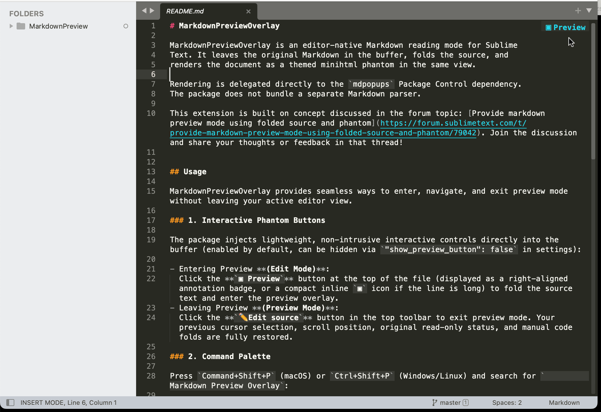

# MarkdownPreviewOverlay

MarkdownPreviewOverlay is an editor-native Markdown reading mode for Sublime Text.
It leaves the original Markdown in the buffer, folds the source, and
renders the document as a themed minihtml phantom in the same view.



This extension is built on concept discussed in the forum topic: [Provide markdown preview mode using folded source and phantom](https://forum.sublimetext.com/t/provide-markdown-preview-mode-using-folded-source-and-phantom/79042). Join the discussion and share your thoughts or feedback in that thread!

## Features & Capabilities

Compared to traditional external browsers or split-pane previewers, **MarkdownPreviewOverlay** renders your Markdown preview directly inside the same editor view while keeping your plain-text workflow intact:

- **Zero Context-Switching**: Read and edit in the exact same view—never leave Sublime Text or juggle external browser windows.
- **No Split-Pane Clutter**: Maximizes your entire editor width without dividing the screen into cramped columns or causing premature line wrapping.
- **Exact Scroll & Cursor Preservation**: Seamlessly preserves and restores your exact cursor positions, active selections, viewport scroll offset, and manual code folds when toggling modes.
- **Lightweight & Theme-Adaptive**: Powered directly by Sublime Text’s built-in `minihtml` engine (`mdpopups`) with zero background servers, minimal memory overhead, and automatic color scheme alignment.
- **Full Complex Markdown Support**: Seamlessly renders complex Markdown constructs, featuring a custom table engine that auto-adapts to your viewport width, along with syntax-highlighted code blocks, blockquotes, and nested lists tailored for miniHTML.

> **Note**: Rendering is delegated directly to the `mdpopups` Package Control dependency without bundling a separate Markdown parser.

## Usage

MarkdownPreviewOverlay provides seamless ways to enter, navigate, and exit preview mode without leaving your active editor view.

### 1. Interactive Phantom Buttons

The package injects lightweight, non-intrusive interactive controls directly into the buffer (enabled by default, can be hidden via `"show_preview_button": false` in settings):

- Entering Preview **(Edit Mode)**:
  Click the **`▣ Preview`** button at the top of the file (displayed as a right-aligned annotation badge, or a compact inline `▣` icon if the line is long) to fold the source text and enter the preview overlay.
- Leaving Preview **(Preview Mode)**:
  Click the **`✏️Edit source`** button in the top toolbar to exit preview mode. Your previous cursor selection, scroll position, original read-only status, and manual code folds are fully restored.

### 2. Command Palette

Press `Command+Shift+P` (macOS) or `Ctrl+Shift+P` (Windows/Linux) and search for `Markdown Overlay` (or type `mdo`):

| Command | Description |
| :--- | :--- |
| **`Markdown Overlay: Toggle`** | Toggles seamlessly between Preview Mode and Edit Mode. |
| **`Markdown Overlay: Preview Mode`** | Enters the rendered preview mode for the active Markdown document. |
| **`Markdown Overlay: Edit Mode`** | Exits preview mode and returns to editing the source buffer. |
| **`Markdown Overlay: Refresh`** | Forces a re-render of the preview layout (useful after resizing the window). |

### Behavior & Document Lifecycle

- **Read-only Safety**: Preview mode makes the buffer temporarily read-only to prevent accidental edits while viewing formatted text.
- **Buffer Integrity**: Source folding uses standard Sublime Text region folding without modifying the buffer text or polluting the undo history.
- **Auto-Refresh**: If the document is modified or saved, the preview updates automatically with debounced re-rendering.
- **Local Images Only**: Operates strictly offline. Only local image files on disk are rendered; remote web images (`http://`, `https://`) are not downloaded.


## Configuration

Access settings and key bindings via the menu: `Preferences -> Package Settings -> MarkdownPreviewOverlay`.

### Settings

Settings can be customized via `Preferences -> Package Settings -> MarkdownPreviewOverlay -> Settings` (or directly in `MarkdownPreviewOverlay.sublime-settings`):

- `show_preview_button` (default: `true`): Controls whether the interactive `▣ Preview` button or badge is displayed at the top of the buffer in edit mode. Set to `false` for a distraction-free editing buffer when using the Command Palette or keyboard shortcuts.
- `hide_line_numbers` (default: `true`): Automatically hides line numbers and the gutter in preview mode for a distraction-free reading experience, and restores them upon returning to edit mode.
- `show_status_indicator` (default: `true`): Controls whether the `MarkdownOverlay` active mode indicator is displayed in the status bar during preview mode. Set to `false` for a completely distraction-free status bar.
- `table_max_width` (default: `null`): Sets the maximum character width for tables rendered in miniHTML. When set to `null`, it dynamically fits within the viewport width.
- `resolve_image_paths` (default: `false`): Controls whether to automatically rewrite local relative Markdown/HTML image paths to absolute `file://` URIs and adapt large images to the viewport. When `false` (default), image paths in Markdown are left as-is. Note that the package operates 100% locally and will not fetch or download remote network images (`http://`, `https://`).
- `image_max_width` (default: `900`): Sets the maximum display width in pixels for rendered images when `resolve_image_paths` is enabled. In narrower viewports or split views, images automatically downscale to fit comfortably without overflowing. Set to `null` for pure viewport-adaptive scaling.

### Key Bindings

To avoid shortcut collisions with other packages, default key bindings are provided as `.example` templates. To enable keyboard shortcuts, open `Preferences -> Package Settings -> MarkdownPreviewOverlay -> Key Bindings` (or copy bindings from the `.sublime-keymap.example` files into your User keymap):

- **macOS** (`Default (OSX).sublime-keymap.example`):
  ```json
  [
      {
          "keys": ["super+alt+m"],
          "command": "markdown_preview_overlay_toggle",
          "context": [{ "key": "selector", "operator": "equal", "operand": "text.html.markdown" }]
      }
  ]
  ```
- **Windows / Linux** (`Default (Windows/Linux).sublime-keymap.example`):
  ```json
  [
      {
          "keys": ["ctrl+alt+m"],
          "command": "markdown_preview_overlay_toggle",
          "context": [{ "key": "selector", "operator": "equal", "operand": "text.html.markdown" }]
      }
  ]
  ```

## Development installation

Clone or link this directory as `Packages/MarkdownPreviewOverlay`, then run
**Package Control: Satisfy Dependencies**. Package Control installs `mdpopups`
according to `dependencies.json`.

Sublime Text build 4050 or newer is required. The package selects Sublime's
Python 3.8 plugin host through `.python-version`.

## License

This project is licensed under the [Apache-2.0 License](LICENSE).
